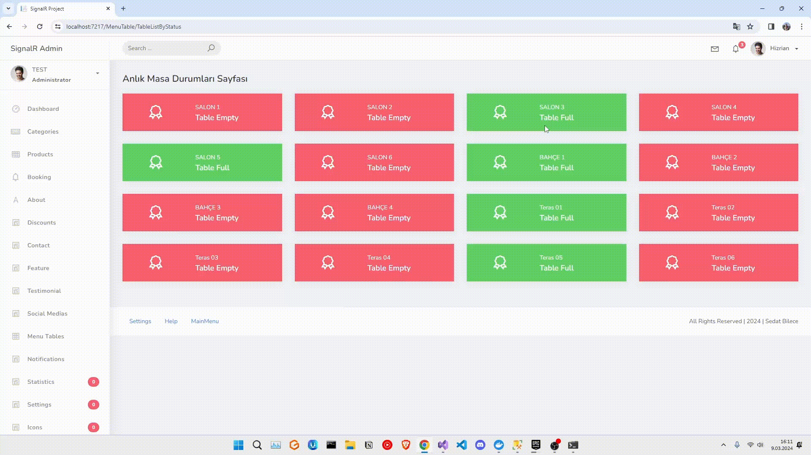
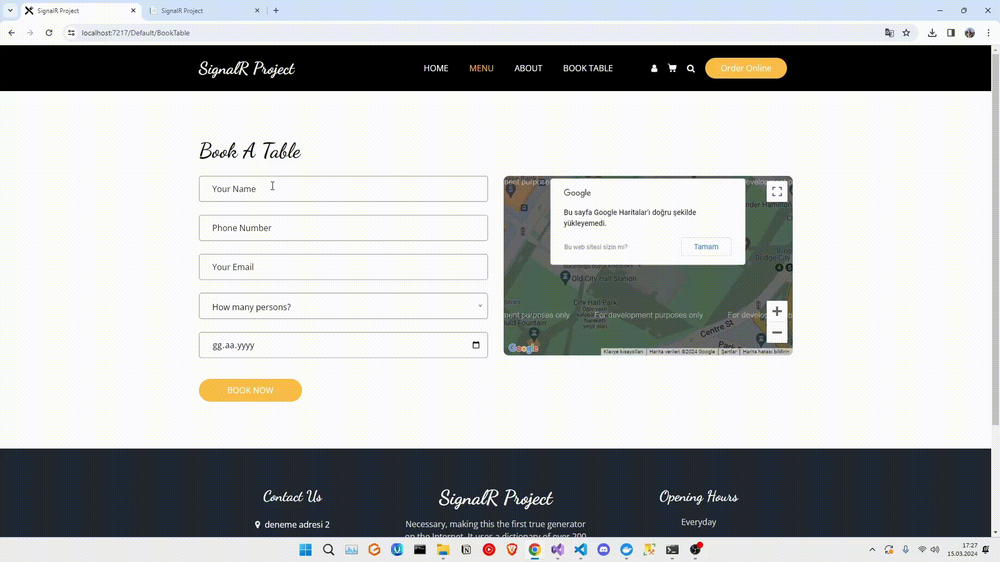

# SignalR Restaurant Project

This project encompasses a basic CRUD (Create, Read, Update, Delete) operations application, coupled with real-time updating of frontend pages using SignalR. CRUD operations facilitate the creation, reading, updating, and deletion of records in the database. Real-time updates using SignalR on the frontend enable users to instantly see changes made by other users.

## Technologies Used:

<ul>
    <li>ASP.NET Core (Backend)</li>
    <li>SignalR (UI - MVC)</li>
    <li>Entity Framework Core (ORM)</li>
    <li>MSSQL (DB)</li>
    <li>HTML, CSS, JavaScript (Frontend)</li>

</ul>

### Admin Side Statistics  (SignalR)

   

### Admin Side Menu Tables  (SignalR)

   

### Admin Side Client Counts  (SignalR)

   

### Messages  (SignalR)

     

### UI Side Landing Page 

   

### UI Side Menu Page

   

### Booking 

   

